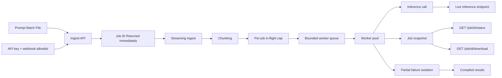

project obj:

build a prod-ready async batch eval engine that reads a file array of prompts from a local workspace, chunks and fans out execution across a bounded worker pool invoking live inference endpoints, shall manage backpressure from upstream endpoints and shall aggregate scattered results into structured reports

FR:
1. Batch file ingest : shall read from local workspace, probably a json containing prompts (say 1000). Should return the job ID immediately.

2. Scatter-Gather distrib : partition the prompts into concurrent execution chunks and feed them to bounded internal worker pool invoking live-inference endpoints. Workers should prioritize cost-efficient confifs for high-throughput
testing

3. Handle backpressure

4. Report partial failures: isolate individual failures. Successfull prompts should be compiled together, GET /job/{id}/status should work and GET /job/{id}/download should retrive the final compiled array

NFR:

1. Should handle OOM crashes in case of resource exhaustion. Should have scaling limits
2. unit and int tests
3. Deploy functionally to git


Iterations on top if time is there:
1. Persist data to DigitalOcean space bucket
2. Webhook support : provide registration of callback url to notify if anyone is listening in case of heavy aggregation processing job

## Index Diagram



## How it works

Submit returns a job ID immediately. One ingest thread streams the JSON array with Jackson, never materializing the full file. Each filled chunk is submitted to the shared worker pool so prompts from the same job run concurrently.

Backpressure is two layers:

- **Per job:** ingest waits once that job already has `batch.max-in-flight-per-job` chunks in the pool (default 4). That stops one large job from filling the workers.
- **Global:** the worker pool is `batch.worker-threads` threads (default 4) plus a queue of `batch.queue-capacity` (default 32). When the queue is full, ingest blocks until a worker takes a chunk. A full ingestion pool rejects new jobs with `503`.

Prompt failures are isolated. Successful prompts stay in the compiled report. `GET /job/{id}/status` works while the job runs; `GET /job/{id}/download` returns the ordered result array after `COMPLETED` or `COMPLETED_WITH_ERRORS`.

OOM during ingest or chunk processing fails the job and increments `batch.oom.errors`. Caps also include `batch.max-prompts`, `batch.max-jobs` (in-flight jobs in memory), and multipart upload size.

Interrupted `QUEUED` or `RUNNING` snapshots are marked `FAILED` on startup. Remaining prompts are not stored, so those jobs are not resumed.

## Running

Spring Boot 3.4, Java 17:

```bash
mvn spring-boot:run
```

Job APIs require `X-API-Key`. The default is `dev-key`; override with `APP_API_KEY`. `/actuator/health` is open.

Place a JSON array of prompts in `./workspace-input` (configurable via `batch.input-directory`):

```bash
curl -H "X-API-Key: dev-key" -X POST --data-urlencode 'file=prompts.json' http://localhost:8080/job/local
curl -H "X-API-Key: dev-key" http://localhost:8080/job/{jobId}/status
curl -H "X-API-Key: dev-key" http://localhost:8080/job/{jobId}/download
```

`POST /job` accepts a multipart upload. Optional `route` selects an inference route; if omitted the job uses `inference.default-route` (`cheap`) for its whole lifetime.

With empty route endpoints the client echoes the prompt for local development. Point `inference.routes[].endpoint` (or `inference.endpoint`) at a POST API that accepts `{ "prompt": "..." }` for live inference. Transient `429`/`5xx` responses retry with backoff.

```yaml
inference:
  default-route: cheap
  routes:
    - name: cheap
      endpoint: https://low-cost-model.example/evaluate
      cost-per-request: 0.001
    - name: premium
      endpoint: https://high-quality-model.example/evaluate
      cost-per-request: 0.02
```

`batch.inference.route.requests` and `batch.inference.estimated.cost` record the selected route and estimated spend. Automatic risk-based escalation is not enabled.

Relevant `application.yml` limits:

| Setting | Default | Role |
|---|---|---|
| `batch.worker-threads` | 4 | Inference workers |
| `batch.ingestion-threads` | 2 | File readers |
| `batch.queue-capacity` | 32 | Shared worker queue |
| `batch.max-in-flight-per-job` | 4 | Chunks one job may have in the pool |
| `batch.max-prompts` | 10000 | Prompts per file |
| `batch.max-jobs` | 1000 | In-memory in-flight jobs |
| `batch.chunk-size` | 25 | Prompts per chunk |

## Persistence and webhooks

Snapshots are written after each chunk and on terminal status, not after every prompt. Finished jobs are evicted from memory; status and download reload from disk. Default store is `./job-data`. For DigitalOcean Spaces set `persistence.type=spaces` and the bucket, endpoint, region, access key, and secret key.

Register a callback after submit. The host must be in `webhook.allowed-hosts` (empty by default, so registrations fail closed until you allowlist hosts):

```bash
curl -H "X-API-Key: dev-key" -X POST http://localhost:8080/job/{jobId}/webhook \
    -H 'Content-Type: application/json' \
    -d '{"callbackUrl":"https://example.com/batch-callback"}'
```

The callback receives job ID, terminal status, and result counters. Delivery uses a separate bounded pool and does not block inference; failures are logged and isolated.

```bash
mvn test
```
